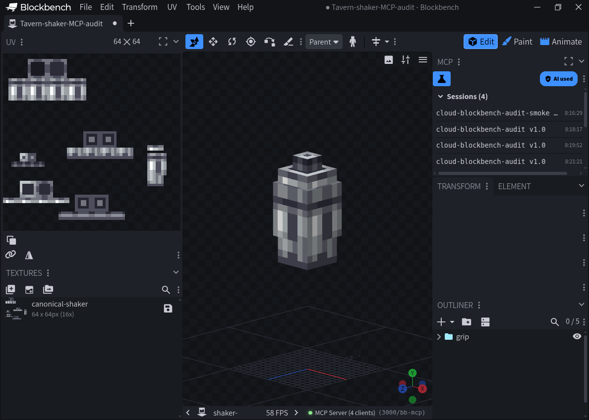

# Blockbench MCP 安裝與實際調用記錄（2026-10-02）

## 已驗證

- 官方 Blockbench 5.2.1 Linux AppImage，SHA-256 `abc3980ad1f1308a2352f7f920c57de8ff61fc2433ea8a64b81aa504c97987bf`
- 第三方 [Blockbench MCP 1.10.0](https://github.com/jasonjgardner/blockbench-mcp-plugin/blob/d0271716c6434add875fd024e9ea6b474bc0ca09/README.md)，使用固定發布檔案的本機安全化副本
- 僅監聽 `127.0.0.1:3000`；實際同機 socket 清單確認，未綁定外部介面
- MCP initialize、tools/list、get_capabilities 均有真實回應，協定版本 2025-11-25
- risky_eval 未出現在啟用工具清單；開啟模型後再次確認 enabled=false
- 真正透過 MCP 建立一次性 Bedrock 模型專案、匯入酒館 0.6.87 的雪克杯 geometry 和貼圖、get_project_info 讀回 5 cubes／1 group／1 texture、調整鏡頭並擷取圖像

此圖證明 MCP 能操作該測試模型和讀回畫面，**不證明手持姿勢、進食動畫或 Java 對齊已通過**。本次未匯入動畫，也未修改 canonical runtime。

## 安全化與權限

本機副本四處明確變更：risky_eval 的執行／可用性 gate 永久回傳 false；settingsSetup 後匯入安全設定並核對有效值，不符合即拒絕啟動；listener host 固定 127.0.0.1；prompt CDN 初始化固定關閉。保留上游與安全副本各自的 SHA-256，詳見[機器可讀記錄](BLOCKBENCH-MCP-SMOKE-20261002.json)。這些修改只用於測試工具，不屬於 addon 發布內容。

使用者明確批准第三方安裝及一次性的網路權限後才啟動。Blockbench 將 net 模組權限稱為完整網路存取；本次選擇 Allow once，實際服務仍受上述本機固定地址限制。未配置外部代理、公開端點或憑證，也沒有連接或部署 Minecraft 伺服器。

## 實際調用路徑與限制

本次執行的是與 Blockbench 同一雲端桌面上的 MCP HTTP 客戶端，透過 MCP JSON-RPC 調用真實插件，不是模擬工具回應。本次從一般工作區連至 localhost 被拒絕（connection refused），改由雲端桌面啟動同機客戶端後成功，沒有擴大網路暴露。

目前沒有把該服務動態註冊到主對話的原生工具清單；不能將「實際 MCP 客戶端調用成功」寫成「主對話原生 MCP 插件註冊成功」。若雲端環境重建或應用關閉，必須重新確認插件、安全設定與實際調用，不能沿用本次狀態。

Blockbench MCP 與 bridge 編輯器不同。此安裝不補足 bridge 缺少的新版 schema/API 資料，也不改變 [bridge GUI 稽核](BRIDGE-GUI-AUDIT-20261002.md) 的未完成驗收項目。
