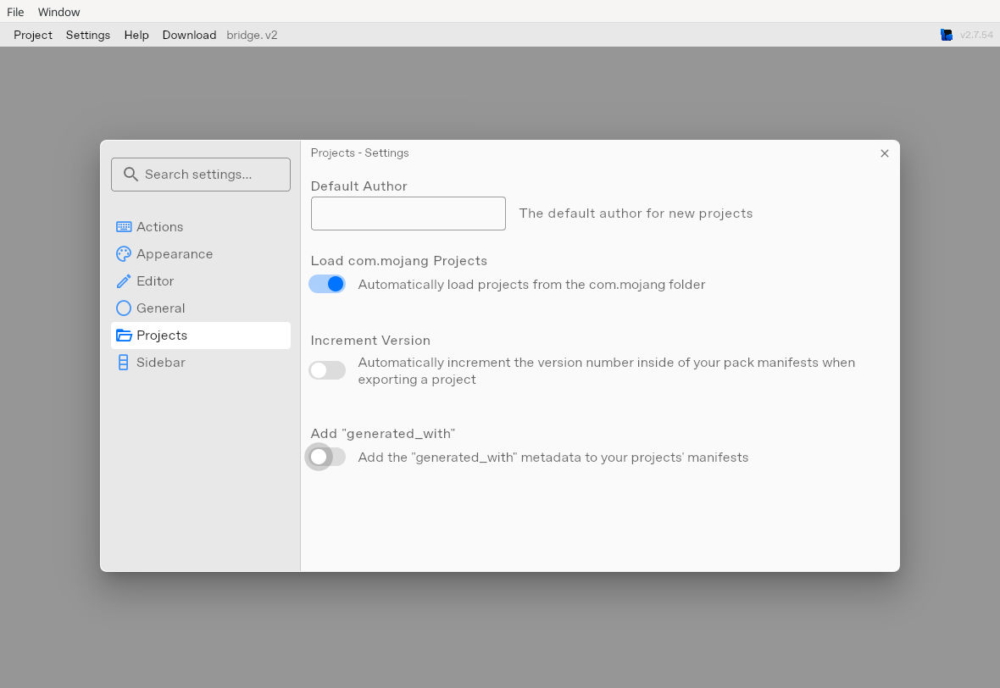

# bridge. GUI 檢查記錄（2026-10-02）

## 結論與範圍

**三包的原生 GUI 載入、編譯、`.mcaddon` 匯出及全檔內容比對已通過，共 6,902 個 runtime 檔案。完整的目前引擎 schema／API 規範驗收仍未完成。**

本次實際操作官方 bridge. 2.7.54 Linux 圖形介面，並非把既有 Dash CLI CI 當作 GUI 證據。檢查採用下列固定 GitHub 基線；後續版本不能自動繼承本記錄。

| 專案 | 版本 | 固定 source commit | BP / RP 檔案 | GUI 匯出比對 |
|---|---|---|---|---|
| Tavern | 0.6.87 | `942ecc10e436fd915ebd9c6313ed83a2b8425df1` | 798 / 3126 | 每個路徑及檔案位元組一致 |
| World Liquor | 0.1.51 | `5aaf5a2482ec92a68a83e94fd7f1ef9b5776ffc8` | 305 / 510 | 每個路徑及檔案位元組一致 |
| Grilling | 2.8.40 | `c29861969b786437de02c151c3856579126b775d` | 504 / 1659 | 每個路徑及檔案位元組一致 |

GUI ZIP 本身的 SHA-256 可以與發佈 ZIP 不同；此處核對的是 BP/RP 內全部路徑與每個檔案的原始 bytes，不豁免 JSON 格式或內容差異。沒有漏檔、多餘 runtime 檔案、重複 archive 路徑或 CRC 錯誤。來源、GUI 產物雜湊及明確驗收旗標見 [機器可讀記錄](BRIDGE-GUI-AUDIT-20261002.json)。

## 逐項結果

| 檢查項目 | 結果 |
|---|---|
| 固定 GitHub 來源、release 產物及 runtime Git blob 身分 | 通過 |
| 原生 GUI 專案載入、BP/RP 路徑辨識 | 通過；煙火 ZIP 匯入，新版酒館／世界名酒採乾淨資料夾載入；只採用最終完整重測結果 |
| manifest UUID、版本、module／dependency 內容保留 | 通過，包含在全檔 bytes 比對中 |
| GUI development／production 編譯與 `.mcaddon` 輸出 | 通過最終 production 輸出比對 |
| 全部 runtime JSON／其他資源在匯出後是否被改寫 | 無差異；不是只抽樣比對 |
| 所有檔案逐一在編輯器開啟並驗證 schema | **未完成，不作此聲稱** |
| 全專案 Problems 彙總 | **工具未實作，不能視為零錯誤** |
| 完整 1.26.50／目前 Script API schema 覆蓋 | **現有官方 bridge 資料不足** |
| Minecraft 手持、進食、燒烤動畫及渲染 | 本記錄未驗收 |
| 存檔遷移／live 部署 | 本記錄未執行 |

本次沒有更動 canonical runtime，沒有為檢查而發布另一套同版本內容，也沒有因此發布新版。

## 已處理的 GUI 內容改寫風險

本次稽核環境的原生編輯器初始開啟 **Increment Version** 與 **Add generated_with**。這些設定可能改寫 manifest，即使操作者只想檢查現有 release。

初次煙火檢查副本受到工具中繼資料改寫；關閉設定後，兩個 manifest 仍留下空的 `metadata: {}`。既有嚴格比較器正確拒絕該副本的 JSON semantic drift。沒有放寬比較器或把這個差異寫回正式包。

處理方式是：**在匯入前先關閉兩個設定，再從未改動的官方基線重新匯入。** 重新 GUI 編譯、匯出的煙火 2,163 個檔案已全部 byte-identical；其他兩包也採取相同設定。

官方行為可查 [loadManifest](https://github.com/bridge-core/editor/blob/v2.7.54/src/components/Projects/Project/loadManifest.ts) 與 [AsMcaddon](https://github.com/bridge-core/editor/blob/v2.7.54/src/components/Projects/Export/AsMcaddon.ts)。已含 generated_with 的副本在關閉設定後可能保留空 metadata，因此只關閉設定不足以還原舊副本。

## GUI 證據

- [酒館 0.6.87：3924 檔編譯](bridge-gui-audit/20261002/tavern.png)
- [世界名酒 0.1.51：815 檔編譯](bridge-gui-audit/20261002/world-liquor.png)
- [煙火 2.8.40：2163 檔編譯](bridge-gui-audit/20261002/grilling.png)

畫面中的編輯器時鐘採測試環境時間；稽核日期以本文件 UTC 日期為準。實際匯出檔案另經各倉庫既有 `tools/bridge_project.py --verify-export <GUI產物>` 驗證，三包結果的 `json_formatting_only` 均為空陣列。

## 新版重測與逐項覆蓋

最初完成的是酒館 0.6.86／世界名酒 0.1.50／煙火 2.8.40，共 6,899 檔。稽核期間前兩包更新，因此另行取得本頁列出的 0.6.87／0.1.51 固定基線並重測；舊版結果僅留在 JSON 的歷史欄位，不替代新版證據。

新版酒館 ZIP 匯入曾留下 1 個空白檔案，此副本已排除。改以未修改的 `.brproject` 解壓資料夾，透過桌面檔案管理器複製至 bridge 專案目錄，再重新啟動編輯器載入；世界名酒也採同一資料夾流程。這是 GUI 資料夾載入成功，不能記成 ZIP 匯入成功。

Choose Project 的 Reload 只刷新已載入列表；[原生啟動](https://github.com/bridge-core/editor/blob/v2.7.54/src/App.ts#L230-L240)才會呼叫[資料夾掃描](https://github.com/bridge-core/editor/blob/v2.7.54/src/components/Projects/ProjectManager.ts)。酒館第一次新版匯出停在 Loading，當時 dev/dist 內容已一致但沒有最終 ZIP，故未算通過。重啟獨立工作階段後，真正 GUI 匯出及完整 ZIP 驗證均已成功；故障根因尚未確定。

GUI 另外實際開啟酒館新版 BP manifest，以及世界名酒新版 BP manifest（包括相依版本）和 bar_stool_black 方塊。後者再次顯示 1.26.50 不在編輯器格式清單內：[新版警告截圖](bridge-gui-audit/20261002/format-warning.png)。這些開檔檢視是明確樣本，不冒充全部檔案逐一開啟。

對相同固定來源另作唯讀盤點：3,789 個 JSON 均能解析；813 個 JSON 的三段式 format_version 高於 bridge 2.7.54 清單最高的 1.26.0，其中 654 個使用 1.26.50。這是格式資料覆蓋風險計數，並不代表這些檔案無效。每包 BP/RP 類型、格式和 API 宣告數據見[規範覆蓋盤點](BRIDGE-FORMAT-INVENTORY-20261002.json)。JSON 語法解析與 GUI schema 驗證明確分開。

## 不能忽略的工具限制

1. bridge. 2.7.54 的 [Problems 面板](https://github.com/bridge-core/editor/blob/v2.7.54/src/components/BottomPanel/BottomPanel.tsx) 是明確的佔位介面。它不是全專案驗證器。
2. [JSONDefaults](https://github.com/bridge-core/editor/blob/v2.7.54/src/components/Data/JSONDefaults.ts) 確實啟用已載入文件的 JSON 診斷，但沒有因此遍歷所有未開啟的檔案；[檔案樹診斷顯示](https://github.com/bridge-core/editor/blob/v2.7.54/src/components/UIElements/DirectoryViewer/FileView/FileWrapper.ts) 也被停用。不能將全檔匯出一致等同全檔 schema 檢查通過。
3. 2.7.54 內附格式資料最高列到 1.26.0。實際 GUI 開啟世界名酒方塊時，對 `format_version: 1.26.50` 顯示「Value is not accepted」。這證明編輯器資料覆蓋不足，不構成把包降級的理由；[Microsoft 的正式 multi-block 文件](https://learn.microsoft.com/en-us/minecraft/creator/documents/multi-blocks?view=minecraft-bedrock-stable) 已使用 1.26.50 方塊格式。
4. 也調查並試用官方 3.0.4 預覽版。其目前發布的[更新資料來源](https://github.com/bridge-core/editor-packages/blob/c60dd624a215adc708e7c098311c0b5d35a7ad41/packages/minecraftBedrock/formatVersions.json)最高為 1.26.30；[API 對應表](https://github.com/bridge-core/editor-packages/blob/c60dd624a215adc708e7c098311c0b5d35a7ad41/dist/minecraftBedrock/fileDefinitions.json)仍缺穩定版 server 2.9.0／server-ui 2.2.0。啟動 v3 亦不代表自動資料更新成功；本次不以 v3 作完整診斷通過依據。
5. 原生 2.7.54 在一次匯出後切換專案時發生 `WatchNotFound` panic，位置對應官方 [watch.rs 的 unwatch().unwrap()](https://github.com/bridge-core/editor/blob/v2.7.54/src-tauri/src/watch.rs)。已透過重新啟動編輯器、單獨開啟下一專案恢復；最終匯出重新比對通過。這是編輯器流程中的故障證據，不是 Minecraft 執行故障證據。

## 可重現流程

1. 固定各 repo commit，使用對應 canonical config 與 BP/RP；保持 UUID、版本和 dependency 不變。
2. 在乾淨 GUI 工作目錄先關閉 Increment Version、Add generated_with，再匯入 `.brproject`；若 ZIP 匯入未完整完成，可使用完全相同 bytes 的乾淨解壓資料夾，透過桌面檔案管理器加入 projects，再重啟原生編輯器掃描載入。
3. 核對專案版本、BP/RP 和未啟用的實驗選項。開啟需要檢視的檔案時，區分真正內容問題與舊 schema／typings 不認識的項目。
4. 由 Pack Explorer「⋮ → Export As → .mcaddon」執行真正 GUI 匯出，等待完成；若編輯器切換故障，重啟後重新確認，不能只憑 Loading 消失當作通過。
5. 對最終產物執行該倉庫的 `python tools/bridge_project.py --verify-export <產物路徑>`，檢查 archive 完整性、檔案清單、UUID、所有 bytes。初始不完整或改寫副本不可作交付依據。
6. 完整的新引擎 schema/API 檢查、Java 行為對齊、Blockbench 模型與真實客戶端動畫驗收各自保留未完成狀態，不由本記錄代替。
