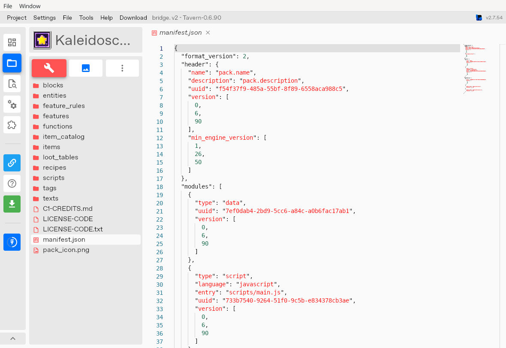
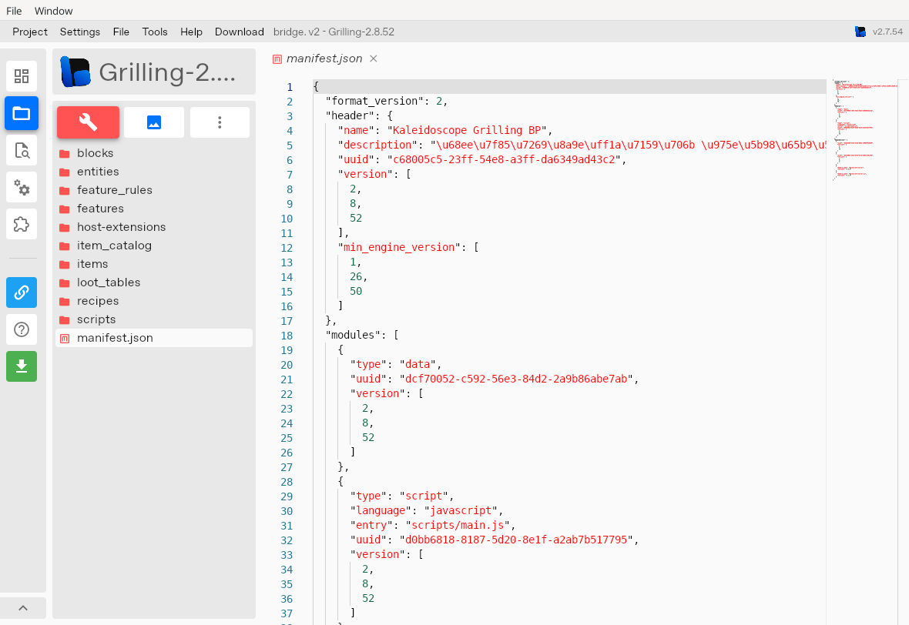
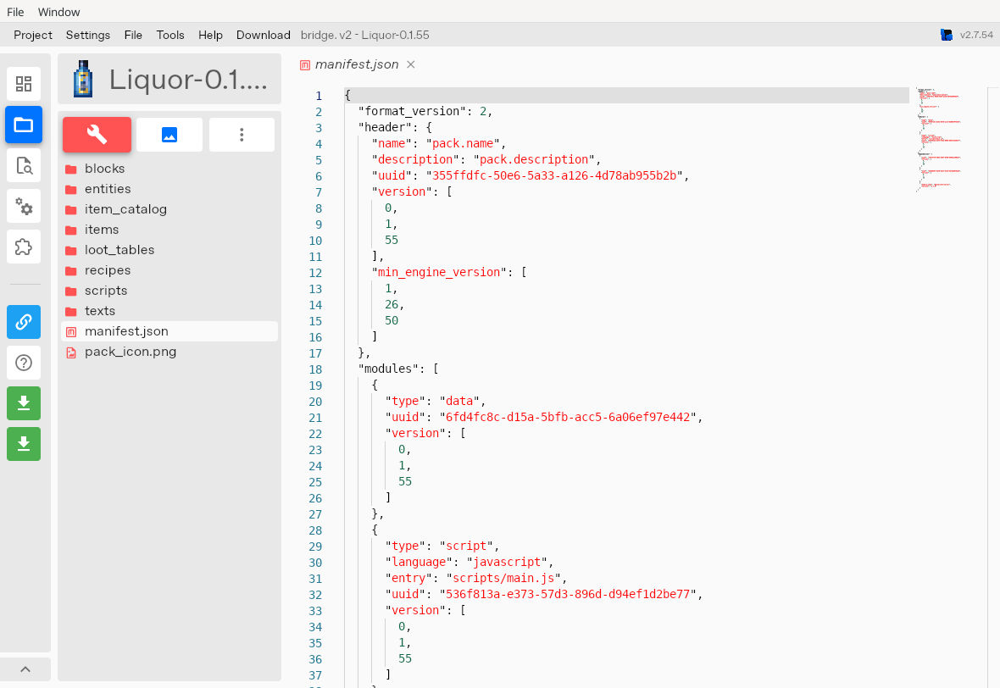

# Development-tool acceptance — 2026-10-03

## What changed

The draft family now pairs Tavern **0.6.90**, World Liquor **0.1.55**, and Grilling **2.8.52** with exact BP/RP dependencies and hashes. Existing upstream archives and load order remain unchanged. World Liquor also shortens twelve generated texture paths without changing image bytes, model IDs, terrain aliases or gameplay. This is a draft-source result, not a release or live deployment.

## Actual bridge GUI check

Official bridge **2.7.54** loaded all three latest projects and exported each through its native **Export As → .mcaddon** GUI. All **6,938 runtime files** match canonical source byte-for-byte: Tavern 798 BP + 3,126 RP, Liquor 305 + 511, Grilling 528 + 1,670. ZIP CRC and duplicate-path checks passed. Increment Version and Add generated_with were visibly disabled before importing.

Tavern was imported through the GUI ZIP route; it took time to unpack. A parallel clean-folder copy encountered the same config file and was cancelled; the final runtime and exported archive were compared in full, rather than trusting that intermediate state. Grilling and Liquor used clean extracted project folders copied through the desktop file manager and loaded after a native restart. Only the audit project display names changed; no runtime bytes were normalized by the editor. Manifests were actually opened, but this does not mean every file was opened individually.

bridge's Problems panel and stale format catalog retain the limitations documented in [the earlier GUI audit](BRIDGE-GUI-AUDIT-20261002.md). Export equality is not complete current-engine schema or renderer acceptance. UI/log clocks are environment-local; the audit date above is UTC.

## Mojang Creator Tools and real MCP invocation

Installed the official npm package **@minecraft/creator-tools 0.19.0** in an isolated development-tools directory, pinned exactly and without install scripts. Node 24.19.0 was used. [Official tool overview](https://learn.microsoft.com/en-us/minecraft/creator/documents/mctoolsoverview?view=minecraft-bedrock-stable), [official source](https://github.com/Mojang/minecraft-creator-tools).

Ran `mct --isolated --single -i <input> -o <reports> validate all` on Liquor and the complete family. Raw finding counts and report hashes are preserved in [the JSON receipt](DEVELOPMENT-TOOLS-AUDIT-20261003.json); MCT did **not** pass globally. Offline/isolated mode omits vanilla resource resolution and the current tool has schema/layout false positives. A process exit code of zero was not treated as a clean report.

Also started an ephemeral **local stdio MCP** process, completed initialize and tools/list (19 tools), and called validateContent on the exact base64-encoded Liquor .55 mcaddon. It recognized one BP, one RP and all 816 files. No network listener or persistent MCP registration was created. Validation returned 41 successful checks, 548 warnings and one error (the missing external Tavern RP when testing Liquor alone). This proves a real tool invocation, not a clean acceptance result. A standalone animation JSON was treated as generic JSON, and validateFile followed a broader project root; those attempts were excluded from exact-pack acceptance. The bounded ZIP input was used for the final smoke result.

### Findings resolved and separated

- **Fixed:** twelve Liquor paths were 101–106 characters relative to the RP. They are now 79–84 characters, with original PNG SHA-256 values retained. MCT standalone PATHLENGTH now passes. The normalizer runs during canonical authoring, never installation/packaging. Five regression tests cover byte preservation, stable aliases, idempotence, regeneration, collision rejection and newly introduced overlong paths. Exact before/after hashes cover all nine reference JSONs; historical storage checks still preserve 664 files
- **False-positive/layout noise:** family PATHLENGTH includes UUID directory names; cross-pack missing textures resolve in other RPs; isolated vanilla lookups cannot resolve by design. Valid string texture entries, constant MER arrays and omitted optional uv_anim are not rewritten just to satisfy mismatched schemas. Microsoft's [render-controller example](https://learn.microsoft.com/en-us/minecraft/creator/reference/content/animationsreference/generated/animationrendercontroller?view=minecraft-bedrock-stable) omits uv_anim
- **Open client-memory risk:** Grilling's sixteen 2048×704 pending atlases total about 88 MiB of decoded RGBA base levels; Tavern's 1632×1428 mixture atlas is about 8.89 MiB. This is arithmetic, not measured simultaneous residency or client failure. Lossless repacking would need coordinated UV/generator tests; no blind downscaling was done
- **Open presentation debt:** Grilling canonical packs lack pack_icon.png, and Tavern icons are 320×320 versus MCT's ≤256 power-of-two recommendation. This does not establish a pack-loading failure
- Third-party documentation/sound-form warnings remain separate; upstream packs were not silently patched

## Isolated native family probe

The canonical working-candidate assembler built **16 packs** and verified their full file lists and order. The existing isolated native test ran on cached official **BDS 1.26.52.3**, with zero logged errors. Tavern passed 24 checks across nine fluid kinds; Liquor .55 registered 32 recipes, 66 pages and 56 shaker inputs. Grilling native container, stack metadata, immutability, lore and unstackable-item probes passed.

This harness intentionally adds test-only overlays and uses a new world. It does not certify exact untouched release first-load/restart, a production saved-world migration, player interaction or client rendering. Guide transfer was **sent_unconfirmed**, with no receipt acknowledgement; it is not proof of displayed guide UI. It is a 1.26.52.3 test, not an exact 1.26.50 run. Full human visual acceptance and Java parity remain open.

## Reuse

1. Pin canonical candidate hashes and preserve immutable release identities
2. Run each repository's functional/baseline/export checks and cross-pack guide contract
3. Re-run GUI export equality after runtime changes; retain manifests, screenshots and whole-pack byte comparisons
4. Use MCT as an additional diagnostic source, retain raw error counts and triage against actual source/runtime evidence
5. Run isolated native tests on the exact selected family; keep real-client and saved-world evidence distinct

Blockbench 5.2.1 plus its existing loopback MCP remains available. The shaker/bottle pose bytes are unchanged from the documented actual Blockbench previews, so those earlier scope-limited checks are reused honestly. Blockception's maintained language server is a possible next Molang diagnostic tool; it was researched but not installed or counted as evidence in this run.
