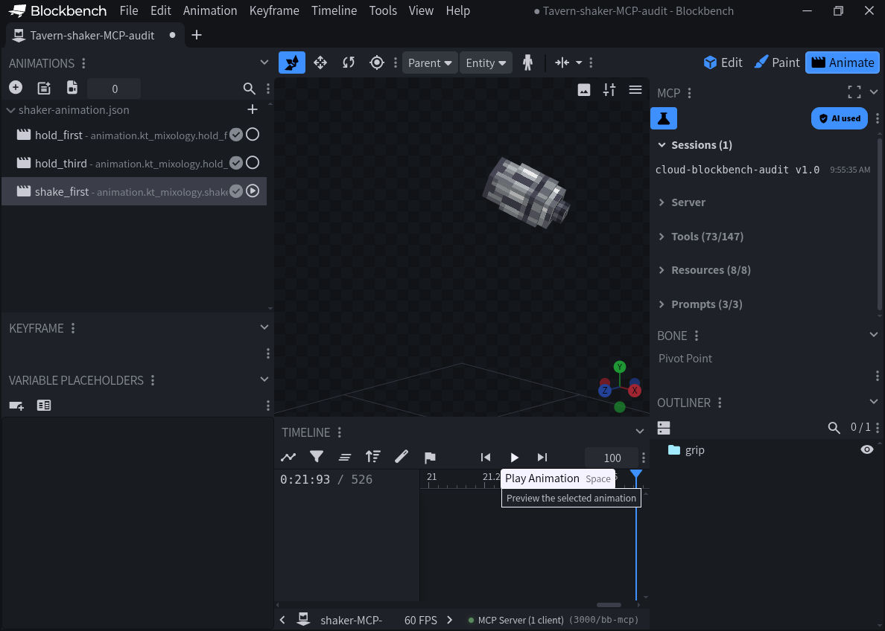

# Shaker native first-person frame correction

Base: `98fe4d7351c719c3705daeeae09788845e5c78c9` (Tavern 0.6.88). Candidate: 0.6.90, rebased onto `7c26aa21361d0e164746b6d5cac6e333b77fc718` after the independent 0.6.89 ambient/XP repair merged. That incoming runtime and release identity are preserved; the inspected shaker poses are unchanged.

## Cause and scope

`held_frame_math.calibration` used a Blockbench display reference arm at [-20,21,0] and a display-camera offset. The shipped attachable binds to the player's item socket, whose pinned Mojang empty-hand hierarchy has a different origin. Reapplying the old local pose to that native socket fails the Java target-corner regression by more than five model units. This explains a concrete alignment risk; it is not an independently observed client screenshot diagnosis.

The replacement includes the arm pivot/empty-hand translation, right-item socket offset and removal of the separately composed [0,24,0] mesh pivot. The camera reference is a head-centered mathematical projection. Native engine eye offsets, FOV, VR and skin variants remain separate client acceptance.

Only first-person idle/use transforms change. Third-person/player-arm channels, selectors, geometry and item behavior retain their exact original values. The held geometry and texture used in the existing MCP model match this source baseline.

## Reference evidence

`art/interfaces/native-fp-frame-1.26.50.4.json` records pinned Mojang URLs and SHA256 hashes, player pivots, empty-hand offsets and the previous shaker channels. Both source downloads were checked against those hashes before implementation. Java display and use references remain in `shaker-held-java-reference.json`, `shaker-hand-source.json` and `docs/source-bytecode/`.

## Actual editor and MCP checks

Blockbench 5.2.1 imported the candidate's actual JSON through Animation → Import Animations. Selected hold_first, hold_third and shake_first, excluding player-arm-only tracks because this model has only grip. The UI played shake_first with the original Molang sinusoid. Local MCP resources/read then returned a real .bbmodel with all three imported animations; no sampled replacement curve was authored. MCP get_project_info and capture_app_screenshot also succeeded.

This screenshot is a standalone model animation preview, not a rendered Minecraft hand or camera. The attachment hierarchy is tested mathematically, not emulated by the editor screenshot. No simulated players, client acceptance or live deployment is claimed.

## Regression coverage

- Existing Java corner/dispatch tests: 4 cases, including sub-tick motion
- New native socket tests: 5 cases; old first-person pose explicitly rejected
- Existing arm/perspective resource check: 1008 pose-axis cases
- Third-person and player-arm tracks must remain byte-equivalent as parsed JSON
- New native socket regression runs through tools/check_release.py in package CI
