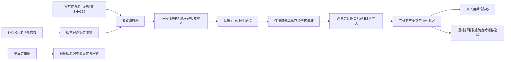

# 森羅家族基線

自移植的酒館、燒烤、世界名酒以各自 Git 為唯一功能來源；官方第三方包以 `upstream.lock.json` 的作者檔案為來源。私服 UUID、AMW 名稱及較大的本地版本號不代表官方更新。

## 發佈與套用

- `baseline_gate.py` 阻止未提交打包、未追蹤來源、同版本換內容、歷史鎖改寫、打包後補丁。CI 和實際打包器共同執行。
- `family_bundle.py` 只複製已提交的自移植 runtime 與雜湊相符的原包；不替換第三方 UUID。重複 identifier 必須列出有效來源。
- `family_guard.py` 用於 BSM `addon_quality/policy.py` 的 `validate_incoming`，必須在世界寫入前執行。完整驗收收據要有 static、bds、client、saved_world_migration 四項實際證據，且只接收完整家族。2026-10-03 起每次開發修復按以下持續授權逐候選登記延期真人驗收，通過其餘三項後先更新 live。
- 准入與巡檢同時識別新 UUID 的森羅定義或家族相依，避免重新命名私服包繞過家族清單；單獨語言包不應攜帶方塊／物品／實體定義。
- 已部署的逐檔收據由 `family_guard.py --world ... --policy ... --report ...` 每 5 分鐘巡檢；報告 `ok` 只表示沒有漂移。舊混合版本被標為 `quarantined`，不能因此宣稱已驗收。
- 燒烤現行爐／進階串架使用持久化原生容器實體，不需要為它們新增 `upcoming_creator_features`。舊式直接方塊容器與既有存檔仍須按實際來源驗收；保留捕獲的實驗設定，不得由打包器擅自開啟。
- 官方廚房與國味的舊私服 UUID 涉及動態資料所有權；先演練保留資料的遷移，再切換到作者 UUID。
- 自移植包的 `addon_localizations` 全檔替換必須退出啟用索引。第三方 `.lang` 可逐鍵漢化；程式修補只能作為有作者回饋、原檔／改後雜湊、有效期限與移除條件的臨時覆蓋。
- 家族相容包的 1.2.x 本地混合版是待拆分資料。未完成上述驗收，不得作為官方原包或新基線發佈。
- `family_upstream_watch.py` 每六小時唯讀核對五個 Bedrock 作者專案的最新檔案，分列正式版／預覽版；新版、作者身份改變及查詢失敗都要求審查。API 憑證只由本機設定／環境提供，不存 Git。巡檢不下载、安裝或自動改版本鎖。
- 使用者 2026-10-03 指示「改 AGENTS.md 每次都應該更新live以測試開發效果」是持續授權：每次功能修復／開發候選完成 canonical PR、檢查與合併，並通過整套 static、bds、saved_world_migration 後，必須更新 luosen live 供真人測試，包括目前候選；備份、正常停服／重啟與政策登記已包含在此授權，不再重複索取許可。純文件變更不改 runtime 時不必換包或重啟。
- 每次仍須停服一致備份、回退版本，以及政策 `deferred_client_acceptance` 中本持續授權的明確指示、記錄時間與**該候選**完整收據 SHA256。持續授權不代表可省略逐候選檢查、沿用另一收據 hash 或繞過 family_guard；檢查失敗時停止部署並報告具體失敗。真人尚未測試，`client` 和 `production_ready` 仍為 false，安裝狀態為 `pending_client_acceptance`；部署成功不是真人驗收。
- 私有的整合附加包可用 `family_bundle.py --extension <canonical Git>` 納入整套收據。其版本、依賴、逐檔鎖與歷史仍須經相同 baseline gate；不得將歷史混合補丁包當作整合來源，不得公開第三方私有資產。
- 整合包相依的其他非家族包可用 `--preserved-pack` 原樣納入逐檔收據與完整依賴檢查；組裝時來源與副本雜湊必須相同。這些包標記為 preserved，不能據此更改其內容或批准其來源漂移。
- `family_saved_world.py` 只在停服的一致存檔副本上遷移世界、實體、玩家及物品內的動態資料 UUID 所有權。目標欄位衝突、NBT 尾碼、非空舊容器會拒絕。逐筆保留證据不能代替原生載入演練；正式使用前保留完整備份並驗證原生載入與資料可讀。

以上檢查能攔截正常 Git／BSM 發佈路徑的混亂。系統管理員直接改檔仍可能繞過入口，因此必須保留安裝後巡檢。

- 使用者明確要求擴充作者 API 時，canonical owned runtime 可宣告 `host-extensions/*.json`。組裝器只在原作者 archive／逐檔 hash 完全吻合時插入已審查的小型呼叫點，複製該 runtime 的版本化 API 模組；逐檔收據標記 `upstream_extended`，保留作者 UUID／版本、原檔與改後 hash、模組來源 commit、獨立 API 版本、到期日及移除條件。原作者私有完整腳本不提交；新作者版必須重新審查。這些登記不得放入翻譯 hook。

- 經使用者本輪油壺修復授權，已登記 API 可對 hash 釘選的作者 item JSON **僅新增** `minecraft:allow_off_hand: true`；不改原有能力、配方、identity 或 manifest。收據同樣列出原檔與改後 hash。組裝器拒絕其他 JSON 屬性、既有欄位或未列入清單的修改。

- 原生 health／同步 property 擴充的 BP `minecraft:player` 必須保留版本釘選原版內容；Grilling 自身生成器檢查其增量。家族組裝器拒絕兩份 BP 玩家定義，收據記錄唯一 effective UUID／路徑／hash；RP 玩家相容與 Windows 心形／效果仍須獨立真人驗收。

## 統一更新入口

整套更新與可核查的階段重用使用 `tools/family_update.py`；設定、命令、保留的fresh存檔門檻及失敗恢復見 [UPDATE-WORKFLOW.md](UPDATE-WORKFLOW.md)。不要再複製一套硬編碼私人部署腳本。CI 去重與變更覆蓋見 [CI-VALIDATION.md](../docs/CI-VALIDATION.md)。

### 國味人偶的暫時渲染相容修補

乾淨作者 1.0.4 的六種人偶同時使用 BP geometry/material 與 RP blocks.json legacy
textures。登記的 `chinesefood-doll-renderer-cleanup` 僅移除六個重複 textures 欄位，
保持 cloth sound 與作者 geometry、材質／資產／UUID。原包 archive、逐檔 preimage、
patched hash、有效期限與回饋狀態均須由已凍結的 canonical integration 聲明。
相容包 1.0.N 的本機國味變體明確標示作者 1.0.4，版本 1.0.(10400+N)；BP／RP
與 modules／相依一起同步，讓客戶端重新取得修正的資源 bytes。此變體不是作者發布，
不改原始 upstream lock，也不能移除其他欄位或借此加入玩法。真人警告／渲染驗收
仍保留 pending；完整家族部署與存檔演練要求照常適用。

## Java 最新版與遠端交付（2026-10-06）

所有修補與適配進入各自 canonical 遠端 Git，私有整合使用核驗的私有遠端。Java 每六小時使用 `tools/family_java_upstream_watch.py --sources family/java-upstream.json` 查核各維護分支，結果寫入 BSM `addon_quality/senluo-java-upstream-status.json`。只查 metadata，無 JAR 全檔重掃／自動安裝；新版要求 recipe/effect/timing/model/input/storage/API 適配工作。相同版本／hash 不能證明一比一，未完成與平台替代保持明示。

Cookery 1.0.8→1.6.0 的作者 UUID 變更使用已提交的 `family/identity-migrations/cookery-108-to-160.json` 與 canonical 更新工具。只允許宣告的作者 BP/RP、原／新版本及原包；先從本次停服備份搬移 world/entity/player/item 所有權，在獨立 BDS 演練，再採用未被測試引擎修改的資料庫。原始 DB／完整回退保留。遷移採用開始後遇失敗保持停服與 recovery lease，不自動重啟不相容的舊所有權 runtime。

## 驗證資料與磁碟容量

2026-10-07 使用者要求刪除舊副本，不再為清理建立封存。已結束的舊測試世界、候選包和多餘回退副本可清理；保留正式存檔、最新兩套完整一致回退、未完成工作、canonical Git、作者原包、現行准入及其實際引用的證據。清理前確認沒有程序仍在使用目錄；既有掛載不應由一般目錄清理器遍歷。

canonical 家族更新器在新建候選、原生驗證與停服前要求至少 15 GiB 可用保留量；原生驗證另預留候選副本，停服前依實際世界／候選磁碟佔用預留四套世界與兩套候選的成長量。這是配置副本的容量預檢，不做新一輪內容 hash，不取代停服備份、迁移與逐檔准入。

完整原生載入與重啟均成功、最後逐檔 audit 通過且引擎無活動程序後，更新器刪除該次 QA 世界多餘的 BP／RP；實際使用的候選、世界 DB、兩次日誌與報告保留。`packs-pruned.json` 記錄候選來源與收據。已清理引擎禁止再次啟動，重跑須新建隔離世界；成功且不可變的證據仍按原條件重用。任何差異、overlay、未完成或失敗驗證都保留現場。

存檔演練直接複製 DB／世界資料並安裝候選包，不先複製隨即刪掉的舊包。正式世界、回退備份與 QA DB 之間不共用可寫檔案。空間不足時在停服前拒絕新配置，清掉已結束的舊副本後再重試；不得靠刪除現行回退或改寫收據通過檢查。

跨部署清理由 `tools/family_update.py --config <本機設定> cleanup-copies` 產生唯讀計畫，加入 `--execute` 才刪除。設定必須明列絕對路徑 `retention_root`；执行前在 host 讀取 `/proc/1/ns/pid` 的 symlink 字串並存入 `retention_pid_namespace`。执行及每次刪除前都核對該值，不能以 sandbox 的隔離 `/proc` 當作 host 已停止的證明。只有部署、准入、原生驗證、重啟、fresh saved-world 與停服備份 metadata 一致的已完成輸出才可退役；最新至少兩套完整回退、current policy／lease 與可追溯 JSON 證據仍引用的資料、失敗／未完成／有活動程序的輸出都保留。存在掛載、symlink、Git 或來源重疊的刪除目標拒絕處理。

清理只刪固定的候選 BP／RP、Exact／Saved QA DB／packs、舊 `production-snapshot`／`production-rollback`／staged 副本；保留原 JSON、日誌、收據與實作／來源資料。不新增封存，不重掃所有歷史世界的內容；只有本次確實要刪舊備份時，才在刪除邊界用既有逐檔收據核對保留的最新兩套快照／回退內容一次，後續刪除沿用該證據並核對其檔案 metadata 未變。`retired-copies.json` 另記錄計畫與結果，原准入收據不改；退役輸出禁止 resume／再部署，中斷後只能繼續同一份清理計畫。設定了 `retention_root` 的新部署成功後自動执行此保留策略；清理另用同一把 maintenance lock，清理失敗不會回退或停止已成功更新的 live。舊設定可用單獨的 cleanup 設定執行，不得改寫其既有發版 config／收據。

`family/cleanup-copies.service.example`／`.timer.example` 示範每小時一次 host 清理；本機設定保留在服務器，不提交憑證或私有驗證內容。定時清理沿用同一 canonical 入口、lock、namespace、policy 引用及保留策略；不能用另一份腳本绕過防護。
