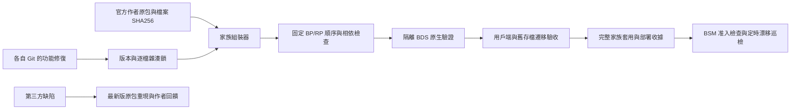

# 森羅家族基線

自移植的酒館、燒烤、世界名酒以各自 Git 為唯一功能來源；官方第三方包以 `upstream.lock.json` 的作者檔案為來源。私服 UUID、AMW 名稱及較大的本地版本號不代表官方更新。

## 發佈與套用

- `baseline_gate.py` 阻止未提交打包、未追蹤來源、同版本換內容、歷史鎖改寫、打包後補丁。CI 和實際打包器共同執行。
- `family_bundle.py` 只複製已提交的自移植 runtime 與雜湊相符的原包；不替換第三方 UUID。重複 identifier 必須列出有效來源。
- `family_guard.py` 用於 BSM `addon_quality/policy.py` 的 `validate_incoming`，必須在世界寫入前執行。批准收據要有 static、bds、client、saved_world_migration 四項實際證據，且只接收完整家族。
- 准入與巡檢同時識別新 UUID 的森羅定義或家族相依，避免重新命名私服包繞過家族清單；單獨語言包不應攜帶方塊／物品／實體定義。
- 已部署的逐檔收據由 `family_guard.py --world ... --policy ... --report ...` 每 5 分鐘巡檢；報告 `ok` 只表示沒有漂移。舊混合版本被標為 `quarantined`，不能因此宣稱已驗收。
- 燒烤的原生爐／進階串架容器需要 `upcoming_creator_features`（實驗性創作者功能）；存檔驗收必須確認，不應由打包器擅自開啟。
- 官方廚房與國味的舊私服 UUID 涉及動態資料所有權；先演練保留資料的遷移，再切換到作者 UUID。
- 自移植包的 `addon_localizations` 全檔替換必須退出啟用索引。第三方 `.lang` 可逐鍵漢化；程式修補只能作為有作者回饋、原檔／改後雜湊、有效期限與移除條件的臨時覆蓋。
- 家族相容包的 1.2.x 本地混合版是待拆分資料。未完成上述驗收，不得作為官方原包或新基線發佈。
- `family_upstream_watch.py` 每六小時唯讀核對五個 Bedrock 作者專案的最新檔案，分列正式版／預覽版；新版、作者身份改變及查詢失敗都要求審查。API 憑證只由本機設定／環境提供，不存 Git。巡檢不下载、安裝或自動改版本鎖。
- 使用者明確要求先部署、之後真人驗收時，可在伺服器政策登記 `deferred_client_acceptance`：明確指示、記錄時間及單一完整收據 SHA256。`client` 和 `production_ready` 仍為 false；static、bds、saved_world_migration 及完整逐檔准入都不能省略。這是單一候選的延期安排，不是所有後續版本的自動批准。
- 私有的整合附加包可用 `family_bundle.py --extension <canonical Git>` 納入整套收據。其版本、依賴、逐檔鎖與歷史仍須經相同 baseline gate；不得將歷史混合補丁包當作整合來源，不得公開第三方私有資產。
- 整合包相依的其他非家族包可用 `--preserved-pack` 原樣納入逐檔收據與完整依賴檢查；組裝時來源與副本雜湊必須相同。這些包標記為 preserved，不能據此更改其內容或批准其來源漂移。
- `family_saved_world.py` 只在停服的一致存檔副本上遷移世界、實體、玩家及物品內的動態資料 UUID 所有權。目標欄位衝突、NBT 尾碼、非空舊容器會拒絕。逐筆保留證据不能代替原生載入演練；正式使用前保留完整備份並驗證原生載入與資料可讀。

以上檢查能攔截正常 Git／BSM 發佈路徑的混亂。系統管理員直接改檔仍可能繞過入口，因此必須保留安裝後巡檢。

- 使用者明確要求擴充作者 API 時，canonical owned runtime 可宣告 `host-extensions/*.json`。組裝器只在原作者 archive／逐檔 hash 完全吻合時插入已審查的小型呼叫點，複製該 runtime 的版本化 API 模組；逐檔收據標記 `upstream_extended`，保留作者 UUID／版本、原檔與改後 hash、模組來源 commit、獨立 API 版本、到期日及移除條件。原作者私有完整腳本不提交；新作者版必須重新審查。這些登記不得放入翻譯 hook。

- 經使用者本輪油壺修復授權，已登記 API 可對 hash 釘選的作者 item JSON **僅新增** `minecraft:allow_off_hand: true`；不改原有能力、配方、identity 或 manifest。收據同樣列出原檔與改後 hash。組裝器拒絕其他 JSON 屬性、既有欄位或未列入清單的修改。

- 原生 health／同步 property 擴充的 BP `minecraft:player` 必須保留版本釘選原版內容；Grilling 自身生成器檢查其增量。家族組裝器拒絕兩份 BP 玩家定義，收據記錄唯一 effective UUID／路徑／hash；RP 玩家相容與 Windows 心形／效果仍須獨立真人驗收。
