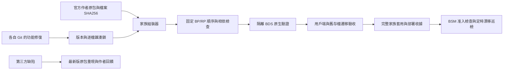

# 森羅家族基線

自移植的酒館、燒烤、世界名酒以各自 Git 為唯一功能來源；官方第三方包以 `upstream.lock.json` 的作者檔案為來源。私服 UUID、AMW 名稱及較大的本地版本號不代表官方更新。

## 發佈與套用

- `baseline_gate.py` 阻止未提交打包、未追蹤來源、同版本換內容、歷史鎖改寫、打包後補丁。CI 和實際打包器共同執行。
- `family_bundle.py` 只複製已提交的自移植 runtime 與雜湊相符的原包；不替換第三方 UUID。重複 identifier 必須列出有效來源。
- `family_guard.py` 用於 BSM `addon_quality/policy.py` 的 `validate_incoming`，必須在世界寫入前執行。批准收據要有 static、bds、client、saved_world_migration 四項實際證據，且只接收完整家族。
- 已部署的逐檔收據由 `family_guard.py --world ... --policy ... --report ...` 每 5 分鐘巡檢；報告 `ok` 只表示沒有漂移。舊混合版本被標為 `quarantined`，不能因此宣稱已驗收。
- 燒烤的原生爐／進階串架容器需要 `upcoming_creator_features`（實驗性創作者功能）；存檔驗收必須確認，不應由打包器擅自開啟。
- 官方廚房與國味的舊私服 UUID 涉及動態資料所有權；先演練保留資料的遷移，再切換到作者 UUID。
- 自移植包的 `addon_localizations` 全檔替換必須退出啟用索引。第三方 `.lang` 可逐鍵漢化；程式修補只能作為有作者回饋、原檔／改後雜湊、有效期限與移除條件的臨時覆蓋。
- 家族相容包的 1.2.x 本地混合版是待拆分資料。未完成上述驗收，不得作為官方原包或新基線發佈。

以上檢查能攔截正常 Git／BSM 發佈路徑的混亂。系統管理員直接改檔仍可能繞過入口，因此必須保留安裝後巡檢。
